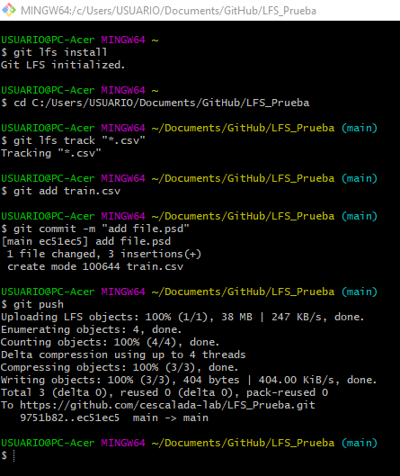

# Pasos para usar Git LFS

## Primero Tener Git
En este enlace está la documentación oficial para descargar e instalar git paso a paso, según tu S.O:
[Documentación Oficial](http://git-scm.com/book/es/v2/Inicio---Sobre-el-Control-de-Versiones-Instalaci%C3%B3n-de-Git)

> **_Una vez instalado git, vas a usar los comandos desde la terminal si usas Linux o desde git bash para el caso de Windows de ahora en adelante._**

### Inicializar Git
Lo primero que deberás hacer cuando instales git es establecer tu nombre de usuario y dirección de correo electrónico:
```
git config --global user.name "nombre_de_mi_usuario"
  
git config --global user.email mi_email@github.com
```
## Segundo instalar Git LFS
Para descargar git lfs: [Descargar aquí](https://git-lfs.github.com/)

Si es la primera vez que vas a instalar git lfs, seguir el procedimiento de la Documentación para cada S.O:
[Procedimiento](https://docs.github.com/es/github/managing-large-files/versioning-large-files/installing-git-large-file-storage)

Para verificar que la instalación haya sido exitosa, escribí:
```
git lfs install
```
Si la instalación fue un éxito debería decir: `> Git LFS initialized. `

## Tercero Crea tu Repositorio
Hay muchas maneras de crear un repositorio y tenerlo de manera local y remota, yo voy a explicar la más fácil que a mí me queda más cómoda.

Crea tu repositorio de manera remota desde tu github primero, una vez creado el repositorio copia el link y clonalo local desde github desktop si usas windows o con git kraken si usas linux.

## Empezar a usar Git LFS
> **_Primero que nada hay que aclarar que para subir un archivo pesado desde git lfs, tu repositorio no debe contener ese archivo, se configura git lfs primero y se guarda en tu repositorio local para subirlo al remoto después._**

* Se supone que ya estás en la terminal de linux o en el git bash de windows.
* Anda al repositorio donde vas a usar Git LFS. ``Ejemplo: C:/Users/USUARIO/Documents/GitHub/LFS_Prueba``
* Ahora asocia **_la extensión_** del archivo que quieres subir a github, a git lfs con el comando `git lfs track`:
* Ejemplo para asociar una extensión csv a git lfs:
```
git lfs track "*.csv"
```
* Si la extensión se asoció con exito te va a decir: ``> Adding path *.csv``
* Copia el archivo y pegalo en tu repositorio.
* Agrega ese archivo a tu repositorio con ``git add tu_archivo.csv``, ejemplo:
```
git add train.csv
```
* Confirma el archivo y súbelo a GitHub:
````
$ git commit -m "add train.csv"
````
````
$ git push
````
* Para más información sobre como configurar el .gitattributes y/o subirlo a otro branch, recomiendo profundizar la documentación:
[Documentación](https://docs.github.com/es/github/managing-large-files/versioning-large-files/configuring-git-large-file-storage)

## Ejemplo Gráfico:

[Click Aqui](https://github.com/cescalada-lab/LFS_Prueba/edit/main/Screenshot.png)




